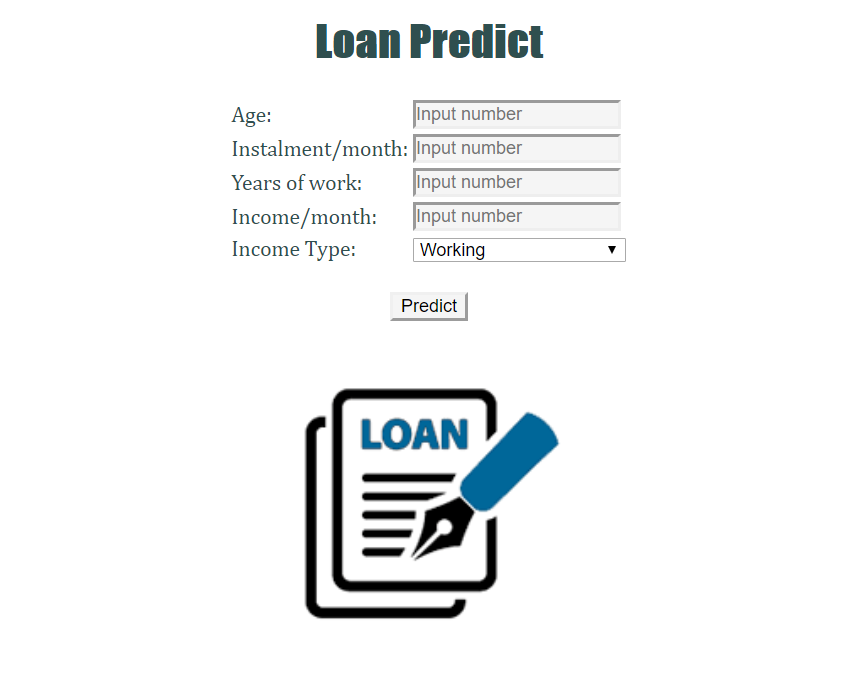
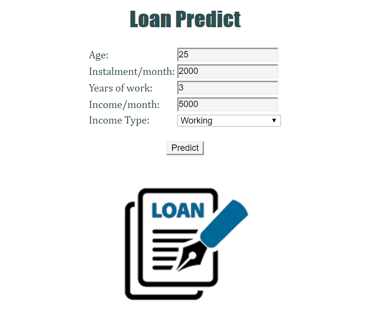
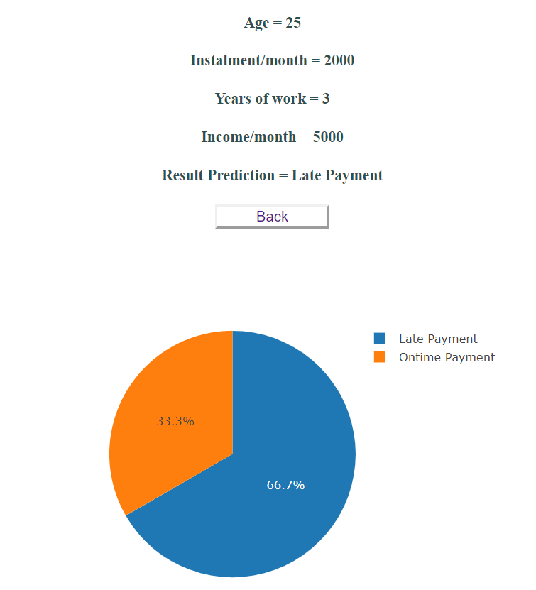

# Final Project

# Loan Predict Classification

#### By: Aulia A Pratama

For most financial institutions, such as banks and multi-finance companies, their main source of income is coming from their lending activities. 

By engaging in this activity, it means that lenders are exposed to the potential risk, where debtors stop repaying their loans, causing losses to the lenders. 

To mitigate this loss, lenders are expected to appropriately choose who are qualified for a loan.

With those problems, I will attempt to make a machine learning model to identify and figure out the important parameter that will affected customers payment. The outcome desired is to make recommendation based on customers profile and loan predict outcome given by user input. 

In this web application, there are only 2 html pages will be shown.

1. Home  
    This is the first page shown when accessing web apps. This page will show which data can be used to make prediction. Data that will be used to make prediction includes customers age, monthly instalment, monthly income, years of work and income type. 
    
    Data inputed then will be used to predict through machine learning model. 

    
    

2. Predict  
    This is the result page that will show prediction result. In this page, user can see the loan probabilty percentage and visualize in a graph.

    

#### Aulia Ashari Pratama | _asharipratamaa@gmail.com_
[Github](https://github.com/AuliaAPratama) | [LinkedIn](https://www.linkedin.com/AuliaAPratama)

